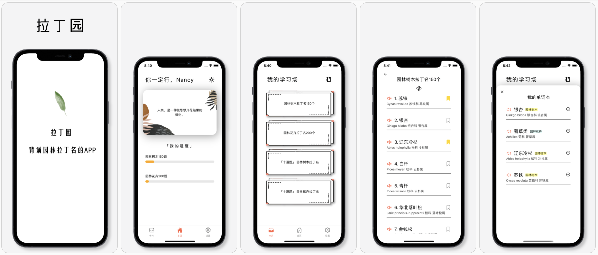

# 拉丁园


## 简介 ☘️
为刻苦背诵拉丁的园林学子，提供的解决方案；  
内含150个园林树木、200个园林花卉拉丁名；  
将词汇做成单词卡和考试题，还有精心录制的读音，陪伴你度过背诵的历程！  


## 数据模式 ⚙️
登陆信息 (async)
```
guest-token: '朋友'
```

收藏单词本 (async)
```
collection: [
  {
    id: "10150",
    date: 12309230590,
    wordset: 1,
    info: {
      "category": "藿香蓟属",
      "chinese": "藿香蓟",
      "family": "菊科",
      "id": "1",
      "latin": "Ageratum conyzoides",
    }
  },
]
```
quizDone (async)
```
quizDone: [10001, 10002, 10003]
```
Quiz progressArr 信息
```
progressArr = [
  {
    id: 10001,
    quizset: 1,
    question: "苏铁的拉丁名是",
    answer: "Cycus Bellitta",
    answerArr: ["Cycus Bellitta", "Beta", "Charlie", "Gamma"]
  },
]

```

Store 存储
```
// store
const initialState = {
  user: {
    token: '',
    name: '',
  },
  loading: false,
  quizDone: [], -> quizDone
  wordDone1: 0, -> mylist1
  wordDone2: 0, -> mylist2

} 
```


## 进展记录 📝
v1.0
- [x] screen navigation and card stacks
- [x] flashcard flip functionality
- [x] store progress locally
- [x] store starred locally
- [x] Xcode build and submit to app store
<br></br>
v2.0
- [x] add authentication with async storage
- [x] add useContext for login
- [x] add redux storage
- [x] add voice
- [x] add bookmark and collection
- [x] add quiz mode and modal
- [x] add toggle list and card
<br></br>
FIX IOS:
- [ ] QuizSetVar - flatlist style - height
问题集：
- [x] IOS simulator expo audio? 点击静音和和不静音按钮
- [x] useEffect 没反应？把async放在setTime out里
= [x] onViewableItems 触发两次？添加`const viewabilityConfig = {itemVisiblePercentThreshold: 50}`


- touable opacity 点击出发
import from 'react native' not guesture handler 

- expo android appkey fail
下载jdk
https://www.oracle.com/java/technologies/javase-downloads.html


-- Faradawn  
2021.8.06


